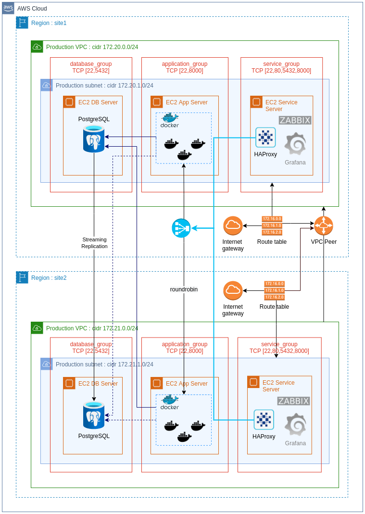

<div>
  <h2 align="center">Home Task</h2>
  <h3 align="center">Author: Valério Oliveira</h2>
  <div align="center">  
    <a href="https://www.linkedin.com/in/valerio-oliveira/?locale=en_US">Visit my LinkedIn</a> · <a href="mailto:valerio.net@gmail.com">E-mail me</a>
  </div>
  <p align="center">
    
  </p>
</div>

## Table of contents

This table of contents is under construction. It will get updated as it reflects the project's progress.

- [x] [Presentation](#presention)
- [x] [Preparing to deploy](#preparing-to-deploy)
- [x] [Deployment](#deployment)
- [x] [Project topology](#project-topology)
- [x] [Application environment](#application-environment)
- [x] [Terraformation](#terraformation)
- [x] [Dockerizing](#dockerizing)
- [x] [Ansible in action](#ansible-in-action)
  - [x] [Database server](#database-server)
  - [x] [Database replication](#database-replication)
  - [x] [Application server](#application-server)
  - [x] [Load balancing with Haproxy](#load-balancing-with-haproxy)
  - [ ] 👉 [Monitoring with Zabbix and Grafana](#monitoring-with-zabbix-and-grafana)
- [ ] [CI/CD with Jenkins](#cicd-with-jenkins)
- [ ] [Orchestration with Kubernetes](#orchestration-with-kubernetes)
- [x] [Personel considerations](#personel-considerations)
- [ ] [References](#references)

---

## Presentation

This project consists in a high availability cluster running on two AWS Regions.

The infrastructure was provisioned with Terraform 1.1.5, whereas the the software layer was deployed using Ansible v. 2.12.1.

The Web application was built into a Docker image with Docker v. 20.10.12 and is available on Dockerhub, from where the playbook gets it.

Moreover, this project is subdivided into tree subprojects:

- Application project: includes the REST application code and Dockerfile
- Terraform project: creates the infrastructure resources
- Ansible project: handles the software layer deployment

### Region 1 contains:

- An EC2 service host with HAProxy load balancer and
- An EC2 application host running 3 instances of the Web application (Django/Python v. 3.2.5)
- An EC2 database host running the Main PostgreSQL v. 13.5 database

### Region 2 contains:

- A seccond service host with HAProxy load balancer
- Another application host running 3 more instances of the Web application (Django/Python v. 3.2.5)
- The database host running the Replica PostgreSQL v. 13.5 database

The application cluster takes advantage of the low latency between the Regions, delivered by the VPC Peer, and enables all docker images (three in each Region) to be part of the application cluster.

---

## Preparing to deploy

After pulling this project into your local machine, you will need to take two steps before deploying the application:

- Create the "inventories" directory into the "ansible" directory
- Create the "variables.auto.tfvars" into the ./terraform/aws/ directory, and set the values for the project variables

I assume that you have already Terraform and Ansible installed and configured in your machine.

> variables.auto.tfvars

```py
terraform_access_key = "..."        # insert here your access key for terraform
terraform_secret_key = "..."        # insert here your secret key for terraform
application_ports    = [22, 8001, 8002, 8003]
database_ports       = [22, 5432]
service_ports        = [22, 8000]
ansible_inventories  = "../../ansible/inventories"
ssh_public_key       = "..."        # insert here the ssh public key for remote hosts' admin user
appserver_secret_key = "django-..." # insert here the django server secret key
dbport               = 5432
dbname               = "revolutdb"  # set a name for the application database as you wish
dbuser               = "dbuser"     # set a name for the application's user
dbpass               = "..."        # set a pasword for the application's user
dbappname            = "Birthday Application"
haproxy_conf         = "../../ansible/roles/haproxy/files"
```

---

## Deployment

Make sure you have created the "variables.auto.tfvars" file as described in the topic above before you run the deployment process.

### The simple way

Use the following Python scripts to make the deployment easier.

> To deploy the application and get it runnning:

```bash
❯ puthon3 run_deploy.py
```

> To proceed the failover:

```bash
❯ puthon3 run_failover.py
```

> To destroy the environment:

```bash
❯ puthon3 destroy_all.py
```

### Manual process

To run all processes manually, you will need to create a couple of directories and files that are automatically created when running through the Python scripts.

#### Infrastructure

> Create the "inventories" directory into the "ansible" directory.

```shell
❯ cd ansible

❯ mkdir inventories

❯ cd ..
```

> Into the Terraform project directory, initialize Terraform, create the project plan, and run it to provision the infrastructure.

```shell
❯ cd terraform/aws

❯ terraform init

❯ terraform plan -out "hometask_plan"

❯ terraform apply "hometask_plan"

❯ cd ../../
```

#### The software layer

> To install all software layer, including Database engine cluster, REST application container instances, and load balancer cluster, go to the ansible directory and run the "deploy.yml" playbook:

```shell
❯ cd ansible

❯ ansible-playbook -i inventories deploy.yml

❯ cd ../
```

> Destroying the environment

---

To destroy the infrastructure you created, go to the Terraform directory and run the following command:

```shell
❯ cd terraform/aws

❯ terraform destroy

❯ cd ..
```

When asked if you really want to destroy all resources, just type "yes" anr press return to proceed.

---

## Project topology

The project follows this topology:

<div>
  <p align="left">
    
  </p>
</div>

## Application environment

The .env file currently present in the application folder exists just to build the Docker image. It will be replaced during the deployment process.

### Details

After provisioning the infrastructure, among other files Terraform will create two files, "site1.env" and "site2.env", which will later be copied to the service host.

Ansible will then replace the .env file by the "site1.env" file content into all application containers.

The "site2.env" file will be kept in case of Site1 gets unavailable.

## Terraformation

All the application "hardware-representing" components are created with Terraform.

Some configuration parameters - security groups inbound ingress ports for instance -, are defined into the "variables.auto.tfvars" file.

Other parameters are set into configurations files used by Ansible playbooks. The way those files are filled or created differs purposely.

## Dockerizing

The application image was built and deployed into my Docker hub repository.

Push Docker image from Dockerhub

```Docker
docker push valerionet/haproxyht:tagname
```

The application's Dockerfile

```docker
FROM python:3

LABEL maintainer="Valerio Oliveira <https://github.com/valerio-oliveira>"
LABEL build_date="2022-01-29"

EXPOSE 8000
WORKDIR /usr/src/app

COPY . .

RUN pip3 install --no-cache-dir -r requirements.txt
RUN python3 manage.py makemigrations
RUN python3 manage.py migrate

CMD [ "python3", "manage.py", "runserver", "0.0.0.0:8000" ]
```

Building the application Docker image locally

```shell
docker build -t valerionet/haproxyht:latest .
```

Deploying to Docker hub

```shell
docker push valerionet/haproxyht:latest
```

---

## Ansible in action

As the most of the work is performed by Ansible playbook, details for every role are not written yet. It will be updated here little by little in near future.

To start deploying the application, Run the following command into the ./ansible directory:

```shell
ansible-playbook -i inventories --forks 1 deploy.yml
```

\* The "--forks 1" directive will only be needed if Ansible is configured to ask to conform first ssh access to the remote servers.

## The database server

Validating PostgreSQL instalation and the database creation:

```bash
❯ ssh -i ./REVOLUT/exam_01/PEM/aws admin@x.x.x.x

admin@site1-db-x:~$ sudo su - postgres

postgres@site1-db-x:~$ psql -d revolutdb -c "select * from base.users;"

 username | birthday
----------+----------
(0 rows)

```

### Database replication

### The application server

### The service host

## Load balancing with Haproxy

The main resource on the service host is the HAProxy load balancer. All requests to the application cluster are made through it.

The load balancer distributes all requests among the application instances. in this project there are six of them, three in each Region.

---

## Database Failover

In case of the main database gets unavailable for any reason, the DataOps team will run the database-failover playbook.

The failover process consists in two steps:

- promoting the standby to main database; and
- to redirect all application requests to the new main database server.

---

## Region Failover

In case of the entire main Region gets unavailable, the DataOps team shall run the same database-playbook.

In addition to proceed the database-failover, the region failover will require DNS redireting.

### About DNS

As DNS management itself is not part of the scope of this project, it is important to mention that in case of a Region gets down, redirecting the DNS to the seccond load balancer is part of the failover process.

---

## Monitoring with Zabbix and Grafana

As monitoring is one of database administrator's main responsibilities, I'm currently wirking on Zabbix and Grafana instalations on the service EC2 host.

---

## Orchestration with Kubernetes

A next step in the near future on my learning path will be implementing container orchestration using Kubernetes.

---

## CI/CD with Jenkins

Another next step will be creating a Jenkins pipeline to deploy new versions of the application image.

Once this aproach will demand a webhook on the server side, I've configured a local Gitlab service where I'm deploying the application's source code already.

---

## Personel considerations

I have chose to use non native tools in order to reduce among the cloud and the project.

---

## References

These are some of the many references I made used of

[Installing Python](https://linuxhint.com/install-python-3-9-linux-mint/)

[Installing Django](https://docs.djangoproject.com/en/3.2/topics/install/)

[Installing Docker](https://idroot.us/install-docker-linux-mint-20/)

[Ansible official docs for PostgreSQL](https://docs.ansible.com/ansible/2.9/modules/list_of_database_modules.html#postgresql)

[Ansible playbook for PostgreSQL](https://gist.github.com/valerio-oliveira/c5f97b92e348a6b6fdda6731c5283e0c)

[Docker container pull creation](https://github.com/do-community/ansible-playbooks/tree/master/docker_ubuntu1804)

[Install docker on debian with Ansible](https://yasha.solutions/install-docker-on-debian-with-ansible/)
