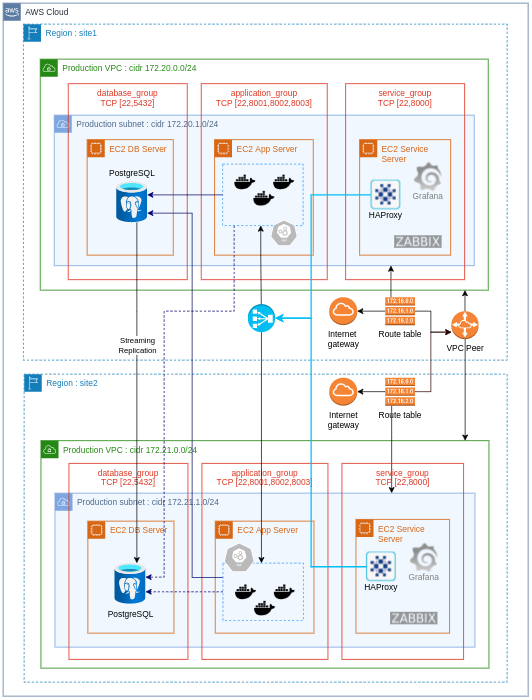
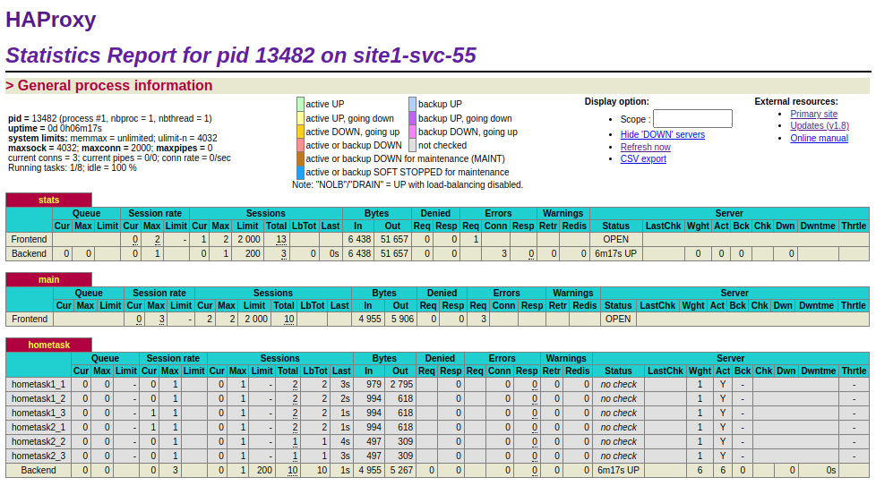

<div>
  <h2 align="center">Home Task</h2>
  <h3 align="center">Author: Valério Oliveira</h2>
  <div align="center">  
    <a href="https://www.linkedin.com/in/valerio-oliveira/?locale=en_US">Visit my LinkedIn</a> · <a href="mailto:valerio.net@gmail.com">E-mail me</a>
  </div>
  <p align="center">
    
  </p>
</div>

## Table of contents

This table of contents is under construction. It will get updated as it reflects the project's progress.

- [x] [Presentation](#presention)
- [x] [Preparing to deploy](#preparing-to-deploy)
- [x] [Deployment](#deployment)
- [x] [Project topology](#project-topology)
- [x] [Application environment](#application-environment)
- [x] [Terraformation](#terraformation)
- [x] [Dockerizing](#dockerizing)
- [x] [Ansible in action](#ansible-in-action)
  - [x] [Database running](#database-running)
  - [x] [Database replication](#database-replication)
  - [x] [The application server](#the-application-server)
  - [x] [The service host](#the-service-host)
  - [x] [Load balancing with HAProxy](#load-balancing-with-haproxy)
  - [x] [Database failover](#database-failover)
  - [x] [Region failover](#region-failover)
  - [ ] 👉 [Monitoring with Zabbix and Grafana](#monitoring-with-zabbix-and-grafana)
- [ ] [CI/CD with Jenkins](#cicd-with-jenkins)
- [ ] [Orchestration with Kubernetes](#orchestration-with-kubernetes)
- [x] [Personel considerations](#personel-considerations)
- [ ] [References](#references)

## Presentation

This project consists in a high availability cluster running on two AWS Regions. I have chose to use non cloud native tools in order to reduce coupling among project and cloud provider.

The infrastructure was provisioned with Terraform 1.1.5, whereas the software layer was deployed using Ansible v. 2.12.1.

The Web application was built into a Docker image with Docker v. 20.10.12 and is available on Docker hub, from where the playbook gets it.

Moreover, this project is divided into tree subprojects:

- Application project: includes the Web application code and Dockerfile
- Terraform project: creates the infrastructure resources
- Ansible project: handles the software layer deployment

### Region 1 contains:

- An EC2 service host with HAProxy load balancer
- An EC2 application host running 3 instances of the Web application (Django/Python v. 3.2.5)
- An EC2 database host running the main PostgreSQL v. 13.5 database

### Region 2 contains:

- A seccond service host with HAProxy load balancer
- Another application host running 3 more instances of the Web application
- A database host running the Standby database

The cluster takes advantage of the low latency offered by a VPC Peer connection between two Regions.

It enables not only the database replication but also scales the aplication among six docker images (three in each Region).

## Preparing to deploy

After pulling this project into your local machine, you will need to take two steps in order to deploy it:

- Create the "inventories" directory into the "ansible" directory
- Create the "variables.auto.tfvars" into the ./terraform/aws/ directory, and set values for the project variables

At this point, I assume that you have Terraform and Ansible installed and configured in your machine already.

> variables.auto.tfvars

```py
terraform_access_key = "..."        # insert here your access key for terraform
terraform_secret_key = "..."        # insert here your secret key for terraform
application_ports    = [22, 8001, 8002, 8003]
database_ports       = [22, 5432]
service_ports        = [22, 81, 8000]
ansible_inventories  = "../../ansible/inventories"
ssh_public_key       = "..."        # insert here the ssh public key for remote hosts' admin user
appserver_secret_key = "django-..." # insert here the django server secret key
dbport               = 5432
dbname               = "revolutdb"  # set a name for the application database as you wish
dbuser               = "dbuser"     # set a name for the application's user
dbpass               = "..."        # set a pasword for the application's user
dbappname            = "Birthday Application"
haproxy_conf         = "../../ansible/roles/haproxy/files"
```

## Deployment

Make sure you have created the "variables.auto.tfvars" file as described in the topic above before you run the deployment commands.

### The simple way

Use the following Python scripts to easy the deployment.

> To deploy the application and get it runnning:

```bash
❯ puthon3 run_deploy.py
```

> To proceed the failover:

```bash
❯ puthon3 run_failover.py
```

> To destroy the environment:

```bash
❯ puthon3 destroy_all.py
```

### Manual process

To run all processes manually, you will need to create the "inventories" directory.

> Create the "inventories" directory into the "ansible" directory.

```shell
❯ cd ansible

❯ mkdir inventories

❯ cd ..
```

> Into the "terraform/aws" directory, initialize Terraform, create the project plan, and apply it to provision the infrastructure.

```shell
❯ cd terraform/aws

❯ terraform init

❯ terraform plan -out "hometask_plan"

❯ terraform apply "hometask_plan"

❯ cd ../../
```

#### The software layer

> To install the entire software layer, including Database engine cluster, the Web application cluster, and load balancer cluster, go to the ansible directory and run the "deploy.yml" playbook:

```shell
❯ cd ansible

❯ ansible-playbook -i inventories deploy.yml

❯ cd ../
```

To destroy the infrastructure you have created, go to the Terraform directory.

> Destroying the environment

```shell
❯ cd terraform/aws

❯ terraform destroy

❯ cd ..
```

When asked if you really want to destroy all resources, just type "yes" and press return to proceed.

## Project topology

The project follows this topology. Items dimmed in gray are to be implemented yet.

<div>
  <p align="left">
    
  </p>
</div>

## Application environment

The .env file currently present in the application directory exists just to build the Docker image. It will be replaced during the deployment process.

### Details

After provisioning the infrastructure, among other files Terraform will create "site1.env" and "site2.env" files, which will later be copied to the application host.

Ansible will then replace the .env file by the "site1.env" file content into all application containers.

The "site2.env" file will be kept to be used in case of Site1 gets unavailable.

## Terraformation

All the project's "hardware-representing" components are created with Terraform.

Some configuration parameters - security groups inbound ingress ports for instance - are defined into the "variables.auto.tfvars" file.

Other parameters are set into configuration files used by Ansible playbooks. The way those files are filled or created differs from one each other purposely.

## Dockerizing

The application image was built and deployed into my Docker hub repository.

> The application's Dockerfile

```docker
FROM python:3

LABEL maintainer="Valerio Oliveira <https://github.com/valerio-oliveira>"
LABEL build_date="2022-01-29"

EXPOSE 8000
WORKDIR /usr/src/app

COPY . .

RUN pip3 install --no-cache-dir -r requirements.txt
RUN python3 manage.py makemigrations
RUN python3 manage.py migrate

CMD [ "python3", "manage.py", "runserver", "0.0.0.0:8000" ]
```

> Building the application Docker image locally

```shell
❯ docker build -t valerionet/haproxyht:latest .
```

> Deploying to Docker hub

```shell
❯ docker push valerionet/haproxyht:latest
```

## Ansible in action

As the most of the work is performed by Ansible playbook, details for every role are not written yet. It will be updated here little by little in near future.

To start deploying the application, Run the following command into the ./ansible directory:

```shell
❯ ansible-playbook -i inventories --forks 1 deploy.yml
```

\* The "--forks 1" directive will only be needed if in your local machine Ansible is configured to ask to confirm "yes" at first ssh access to remote servers.

---

### Database running

Validating PostgreSQL instalation and the database creation after deployment.

```bash
❯ ssh -i ./REVOLUT/exam_01/PEM/aws admin@x.x.x.x

admin@site1-db-x:~$ sudo su - postgres

postgres@site1-db-x:~$ psql -d revolutdb -c "select * from base.users;"

 username | birthday
----------+----------
(0 rows)

```

---

### Database replication

After the deployment, it is expected that the database cluster work like a charm. You may validate this by running the following commands:

> On the main host:

```bash
❯ ssh -i ./REVOLUT/exam_01/PEM/aws admin@x.x.x.x

admin@site1-db-x:~$ sudo su - postgres

postgres@site1-db-x:~$ psql -d revolutdb -c "select * from pg_stat_replication;"
```

> On the standby:

```bash
❯ ssh -i ./REVOLUT/exam_01/PEM/aws admin@x.x.x.x

admin@site1-db-x:~$ sudo su - postgres

postgres@site1-db-x:~$ psql -d revolutdb -c "select \* from pg_stat_wal_receiver;"
```

---

### The application server

...

---

### The service host

---

### Load balancing with HAProxy

The main resource on the service host is HAProxy load balancer. All requests to the application cluster are made through it.

In this project there are six application instances, three in each Region. It is possible to monitor the application cluster health by using the HAProxy statistics report.

> Accessing the /stats route on "http://ServiceHostAddress:81/stats":

<div>
  <p align="left">
    
  </p>
</div>

---

### Database failover

In case of the main database gets unavailable for any reason, the DataOps team will run the database-failover playbook.

The failover process consists of two steps:

- promoting the standby to main database; and
- redirecting all application requests to the new main database server.

---

### Region Failover

In case of the entire main Region gets unavailable, the DataOps team shall run the same database-failover playbook as before.

In addition, the Region failover will require DNS redireting.

> About DNS

As DNS management itself is not part of the scope of this project, it is important to mention that in case of a Region gets down, redirecting the DNS to the seccond load balancer is part of the failover process.

---

### Monitoring with Zabbix and Grafana

As monitoring is one of database administrator's main responsibilities, I'm currently wirking on Zabbix and Grafana instalations on the service cluster.

## CI/CD with Jenkins

A next step will be creating a Jenkins pipeline to deploy new versions of the application image.

Once this aproach will demand a Web hook on the server side, I've configured a local Gitlab service where application's source code is getting commited to.

On the GitLab repository, a Web hook will be set to trigger the pipeline, which will start the building new image, uploading to Git hub, and triggering the Ansible playbook. The Ansible playbook, in its turn, will update the application containers.

## Orchestration with Kubernetes

Another next step in the near future on my learning path will be implementing container orchestration using Kubernetes.

## Personel considerations

This project is a landmark on my career as a Software Developer and Database Administrator since it helped me to expand my competences as a DevOps practitioner. It filled the gaps I had on undestanding the full development life cycle. Putting in practice the knowledge aquired is part and parcel on validating it, and I strongly recommend anyone who want to master a tech role to create their own Tech-Trail.

## References

These are just a few of the many references I made used of:

[Installing Python](https://linuxhint.com/install-python-3-9-linux-mint/)

[Installing Django](https://docs.djangoproject.com/en/3.2/topics/install/)

[Installing Docker](https://idroot.us/install-docker-linux-mint-20/)

[Ansible official docs for PostgreSQL](https://docs.ansible.com/ansible/2.9/modules/list_of_database_modules.html#postgresql)

[Ansible playbook for PostgreSQL](https://gist.github.com/valerio-oliveira/c5f97b92e348a6b6fdda6731c5283e0c)

[Docker container pull creation](https://github.com/do-community/ansible-playbooks/tree/master/docker_ubuntu1804)

[Install Docker on Debian with Ansible](https://yasha.solutions/install-docker-on-debian-with-ansible/)

[Zabbix Docs](#https://www.zabbix.com/manuals)
